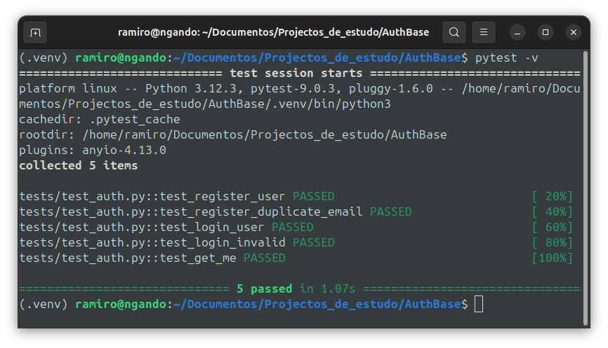

# AuthBase

Uma API base para autenticação e gerenciamento de usuários.

## 🛠️ Tecnologias Usadas


---

## Funcionalidades

- Registro de usuários
- Login e autenticação JWT
- Gerenciamento de usuários (CRUD)
- Segurança com hashing de senhas
- Validação de dados com Pydantic

## Imagem de Teste

 

## Instalação

1. Clone o repositório:
   ```
   git clone https://github.com/rngando/AuthBase.git
   cd AuthBase
   ```

2. Instale as dependências:
   ```
   pip install -r requirements.txt
   ```

3. Configure o banco de dados (exemplo com SQLite):
   - Edite `app/core/config.py` para definir a URL do banco.

4. Execute as migrações (se aplicável) ou inicie o servidor.

## Uso

Para iniciar o servidor:
```
uvicorn app.main:app 
```

A API estará disponível em `http://localhost:8000`.

### Endpoints principais

- `POST /auth/register`: Registrar novo usuário
- `POST /auth/login`: Fazer login
- `GET /users/me`: Obter dados do usuário logado (requer token)
- `PUT /users/{user_id}`: Atualizar dados do usuário admin ou o próprio usuário

Para mais detalhes, consulte a documentação automática em `/docs` ou `/redoc`.

## Estrutura do Projeto

```
README.md
requirements.txt
app/
├── main.py              # Ponto de entrada da aplicação
├── api/
│   ├── deps.py          # Dependências da API
│   └── routes/
│       ├── auth.py      # Rotas de autenticação
│       └── users.py     # Rotas de usuários
├── core/
│   ├── config.py        # Configurações
│   ├── dependencies.py  # Dependências globais
│   └── security.py      # Utilitários de segurança
├── db/
│   ├── base.py          # Base do banco de dados
│   └── session.py       # Sessão do banco
├── models/
│   └── user.py          # Modelo de usuário
├── repositories/
│   ├── auth_repository.py    # Repositório de auth
│   └── user_repository.py    # Repositório de usuários
├── schemas/
│   ├── auth.py          # Schemas de auth
│   └── user.py          # Schemas de usuários
└── services/
    ├── auth_service.py  # Serviço de auth
    └── user_service.py  # Serviço de usuários

tests/
├── conftest.py
└── test_auth.py
```


## Contribuição

Sinta-se à vontade para contribuir! ou dando feedbak pelo telegram https://t.me/ramiro920

## Licença

Este projeto é de uso educacional. 